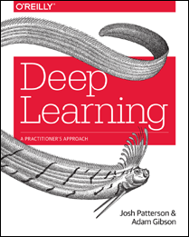

# 詳説 Deep Learning

---



---

本リポジトリはオライリー・ジャパン発行書籍『[詳説 Deep Learning —— 実務者のためのアプローチ](http://www.oreilly.co.jp/books/9784873118802)』（原書名『[Deep Learning: A Practitioner's Approach](http://shop.oreilly.com/product/0636920035343.do)』）のサポートサイトです。

## サンプルコード

サンプルコードの解説は本書籍をご覧ください。

### 使用方法

[Maven](https://maven.apache.org/)を用いてサンプルコードをビルドしてください。

```bash
$ mvn clean install 
```

サンプルプログラムを実行するには`runexamples.sh`スクリプトを用いてください（[bash](https://www.gnu.org/software/bash/)環境が必要です）。

```bash
$ ./runexamples.sh
```

スクリプトを実行するとサンプルプログラムのリストが表示されます。実行したいサンプルプログラムの番号を記入し、エンターキーを押せばプログラムが走り始めます。すべてのプログラムを順々に実行したい場合は`runexamples.sh`の引数に`--all`を追加してください。他のオプションは`-h`を引数に追加すると確認できます。

```bash
$ ./runexamples.sh [-h | --help]
```

もちろん、[IntelliJ IDEA](https://www.jetbrains.com/idea/)などの統合開発環境を用いることもできます。

## 検証環境

日本語版で検証に使用した各ソフトウェアのバージョンは以下のとおりです。

* macOS Mojave
* Java JDK 1.8.0_212 
* Maven 3.6.1

## 資料

さらなる情報に関しては[deeplearning4j.org](http://deeplearning4j.org/)や、DL4Jの[JavaDoc](https://deeplearning4j.org/api/latest/)をご覧ください。

もし何か問題がありましたらエラーログとともにissue等でご連絡ください。修正案がありましたらプルリクエストを送ってください。皆様のフィードバックをお待ちしております。

## 正誤表

まだありません。誤植など間違いを見つけた方は、japan@oreilly.co.jpまでお知らせください。
